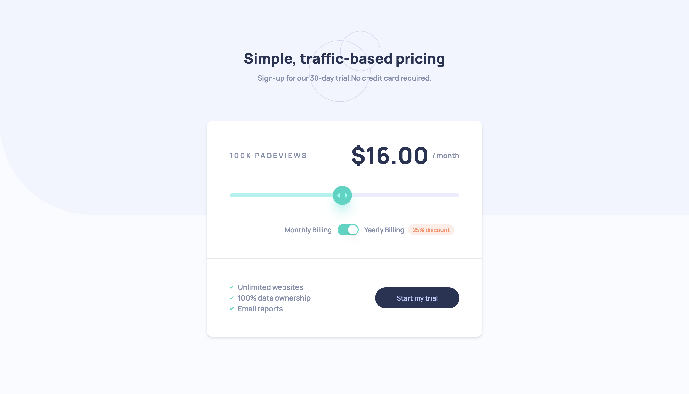

# Frontend Mentor - Interactive pricing component solution

This is a solution to the [Interactive pricing component challenge on Frontend Mentor](https://www.frontendmentor.io/challenges/interactive-pricing-component-t0m8PIyY8). Frontend Mentor challenges help you improve your coding skills by building realistic projects.

## Table of contents

- [Overview](#overview)
  - [The challenge](#the-challenge)
  - [Screenshot](#screenshot)
  - [Links](#links)
- [My process](#my-process)
  - [Built with](#built-with)
- [Author](#author)

## Overview

### The challenge
Users should be able to:

- View the optimal layout for the app depending on their device's screen size
- See hover states for all interactive elements on the page
- Use the slider and toggle to see prices for different page view numbers

### Screenshot
#### Desktop

#### Mobile

### Links

- Solution URL: [GitHub Repository](https://github.com/MuniruIssah/frontendmento-main/tree/main/src/pages/components/interactive-pricing-component)
- Live Site URL: [Live Site](https://frontendmento-main.vercel.app/components/interactive-pricing-component/)

## My process

### Built with

- Semantic HTML5 markup
- [Shadcn Unstyled Slider](https://ui.shadcn.com/docs/components/slider)
- [Shadcn Unstyled Switch](https://ui.shadcn.com/docs/components/switch)
- CSS custom properties
- Mobile-first workflow
- [React](https://reactjs.org/) - JS library
- [Gatsby.js](https://www.gatsbyjs.com/) - React framework
- [Tailwind](https://tailwindcss.com/) - For styles

## Author

- Website - [Issah Muniru](https://muniruissah.github.io/muniru-issahs-portfolio/)
- Frontend Mentor - [@MuniruIssah](https://www.frontendmentor.io/profile/MuniruIssah)
- Twitter - [@ningen_dewa_nai](https://www.twitter.com/ningen_dewa_nai)
