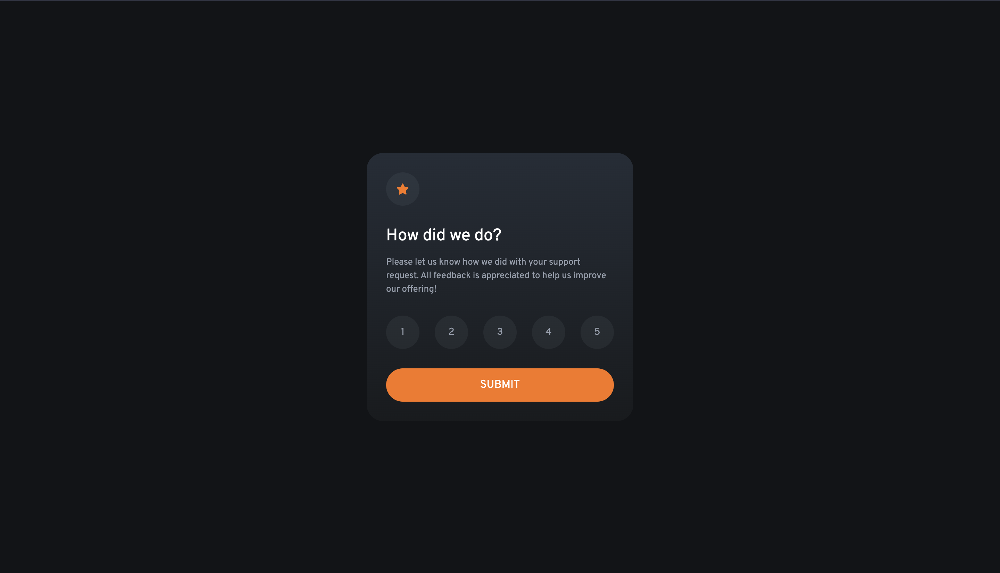
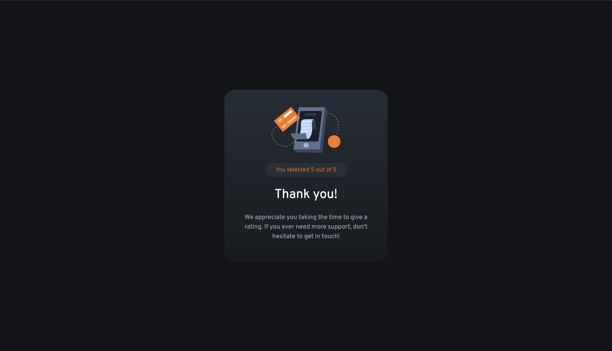
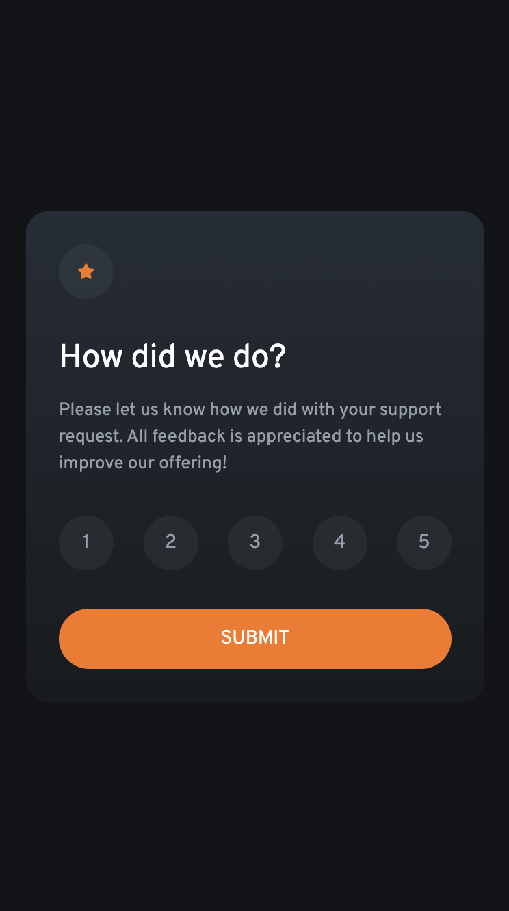
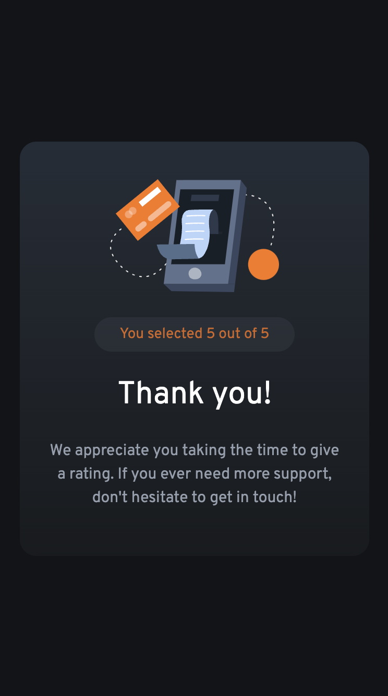

# Frontend Mentor - Interactive rating component solution

This is a solution to the [Interactive rating component challenge on Frontend Mentor](https://www.frontendmentor.io/challenges/interactive-rating-component-koxpeBUmI). Frontend Mentor challenges help you improve your coding skills by building realistic projects.

## Table of contents

- [Overview](#overview)
  - [The challenge](#the-challenge)
  - [Screenshot](#screenshot)
  - [Links](#links)
- [My process](#my-process)
  - [Built with](#built-with)
  - [Awesome Sections](#awesome-sections)
- [Author](#author)

## Overview

### The challenge

Users should be able to:
- View the optimal layout for the app depending on their device's screen size
- See hover states for all interactive elements on the page
- Select and submit a number rating
- See the "Thank you" card state after submitting a rating

### Screenshot
#### Desktop
##### Form

##### Thank You


#### Mobile
##### Form

##### Thank You



### Links

- Solution URL: [GitHub Repository](https://github.com/MuniruIssah/product-preview-card)
- Live Site URL: [Live Site](https://product-preview-card-git-main-muniruissah.vercel.app/)

## My process

### Built with

- Semantic HTML5 markup
- CSS custom properties
- Mobile-first workflow
- [React](https://reactjs.org/) - JS library
- [Gatsby.js](https://www.gatsbyjs.com/) - React framework
- [Tailwind](https://tailwindcss.com/) - For styles


### Awesome sections
Here are some snippets of the code that I think are awwwwesome:
```jsx
  <div className={'w-full flex justify-between'}>
      {new Array(5).fill(0).map((item,index)=><Rating key={index+1} handleChange={handleChange} active={activeState}>{index+1}</Rating>)}
  </div>
```
```js
    const handleSubmit=()=>{
        if(!activeState){
            alert('Please select a rating');
            return;
        }
        setSubmitted(prevState => !prevState);
    }
```


## Author

- Website - [Issah Muniru](https://muniruissah.github.io/muniru-issahs-portfolio/)
- Frontend Mentor - [@MuniruIssah](https://www.frontendmentor.io/profile/MuniruIssah)
- Twitter - [@ningen_dewa_nai](https://www.twitter.com/ningen_dewa_nai)
